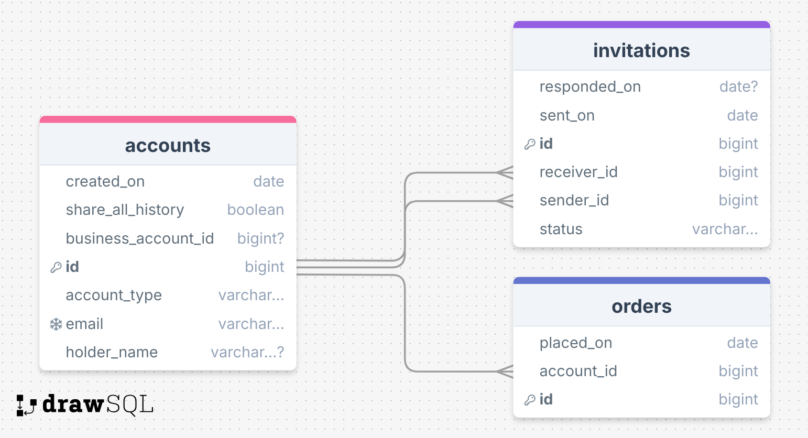
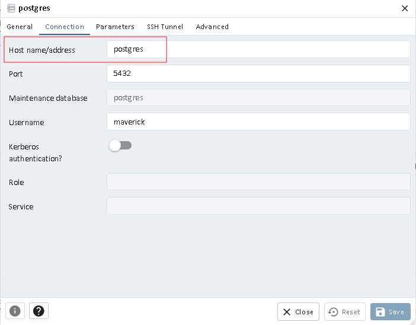
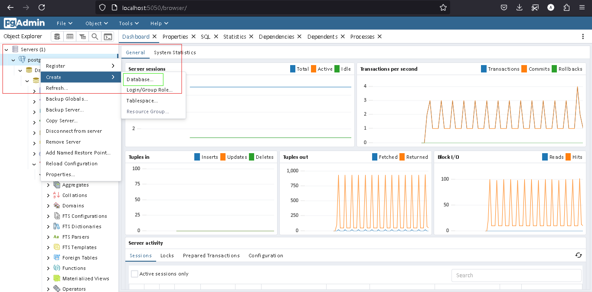

## Overview

**SupplyHouse** is an e-commerce website that allows customers to create accounts and view their order history. Our
customers are either **individuals or businesses**. Currently, a business can have multiple employees place orders with
us, thus needing multiple accounts. We want to develop a new functionality to link those accounts, thereafter *
*subaccounts**,
to a common business account, thereafter **business owner account**.

For example, Bob has his own business and an account with SupplyHouse. His employees, Jane and Jack, also have their own
accounts, and all 3 of them have placed orders on our website. We would like to link Jane and Jack account to Bob’s
account, so that Bob can see the orders that Jane and Jack have placed. Bob would need to send an invitation to Jane and
Jack SupplyHouse accounts, and they can either accept or decline the invitation.

### Functional Requirements

- A **SupplyHouse** account shall have the ability to request to upgrade their account to a **business owner account**.
  If the account has placed at least 10 orders within the past year, the request will be approved.
- Once approved, the business owner account shall have the ability to send invitations to other **SupplyHouse** accounts
  to join their business as **subaccount**.
- After receiving such invitations, a **SupplyHouse** account shall have the ability to either accept or decline the
  invitation. If they accept it and become a **subaccount**, they can decide to share their order history from either
  their account creation date or the date they accept the invitation. A **subaccount** can only be linked to one
  **business owner account**, thus other business owners won’t have the ability to invite them to their account.
- At any point in time, a **subaccount** shall have the ability to unlink their account from the **business owner
  account**. Conversely, a **business owner account** can also unlink any **subaccounts** if they wish. Once a
  **subaccount** leaves a **business owner account**, they can be invited to and linked to other businesses.

### Database Model

Following is database model supporting the hierarchy and robust operations on Supply House accounts.

### Documentation

- The APIs have been documented in **Swagger** interface which can be accessed
  via `http://localhost:9082/swagger-ui/index.html`.
- Additionally, a collection of APIs exported from **Postman** client has also been
  included [here](api_collection/Supply%20House%20Accounts.postman_collection.json).
- A `puml` file has been included here to generate class diagram via **PlantUML** plugin.
- An executable sql file has been included [here](src%2Fmain%2Fresources%2Fschema.sql).

### Assumptions

- All requests to access the APIs are made by authenticated and authorized users.

### Setup Instructions

- Clone the **Github** repository in your machine by executing `gh repo clone AdityaGoyal15/supplyhouse-accounts`.
- From the root directory of the cloned repository, execute `docker compose up` to start **postgres** and **pgAdmin**
  services.
- In the browser, go to `http://localhost:5050`, and login using the password **maverick**. Add a database server by
  clicking on the link available on the **pgAdmin** home page. Make sure to enter the right connection properties.
  Refer screenshot below in case of doubt.
  
- When successfully connected to the **postgres** service via **pgAdmin**, create a database named **supplyhouse**.
  Refer the screenshot below.
  
- Start the application from `AccountsApplication` class.
- If you do not have client installed to test the APIs, please install one e.g. **Postman**, **Insomnia**. Else, if you
  are familiar with **Swagger**, please use the link `` to access **Swagger UI** to test the APIs.
- To help you more, an API collection exported from **Postman** has been
  included [here](api_collection/Supply%20House%20Accounts.postman_collection.json) in this
  project.

At last when satisfied, cheers!